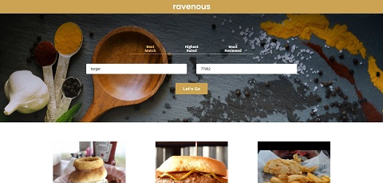

# Ravenous

Ravenous was a guided project that was completed as part of Codecademy's Create a Front-End App with React skill path, in which we were instructed to build a Yelp-like clone called “Ravenous”. The requirements were to utilize React to build a UI for the site that would allow users to search for and view a list of restaurants returned by the Yelp API and be able to sort through the restaurants using a filter.

This project was broken up into the 4 parts below, where each stage built upon the previously implemented functionality:

1. Create Static Components
2. Pass Information to Components
3. Set the State of Ravenous Components
4. Interact with the Yelp API

Project Extensions:

Additionally, I chose to implement a few of the suggested project extensions which are as follows:

* Make addresses clickable and have them open the address in Google Maps in a new tab.
* Make images clickable and have them open the business’ Yelp page in a new tab.
* Clicking on a different sorting option automatically requeries the Yelp API, rather than having to manually click “Let’s Go” again.
* Allow users to search by pressing “Enter” on the keyboard, as opposed to manually clicking the button.

## Table of Contents

- [Technologies](#technologies)
- [Screenshots](#screenshots)
- [Status](#status)

## Technologies

This project was created with:

- JavaScript ES6
- Node.js version: 14.15.1
- Create React App version: 4.0.3

## Screenshots

## Status

This project has been completed.